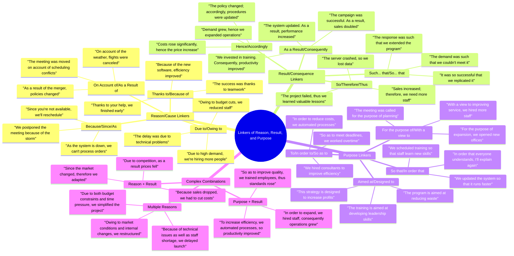
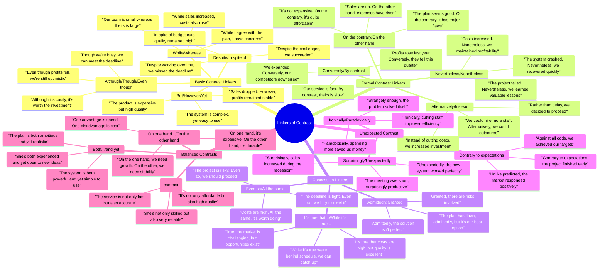
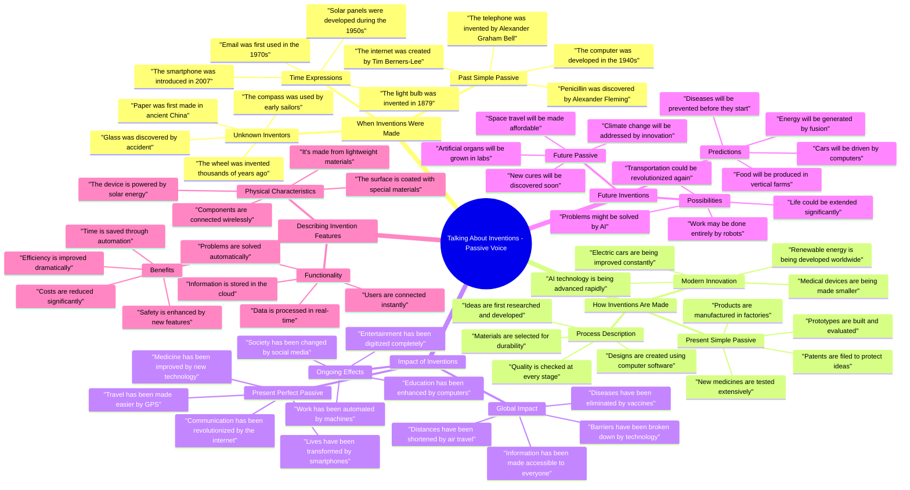
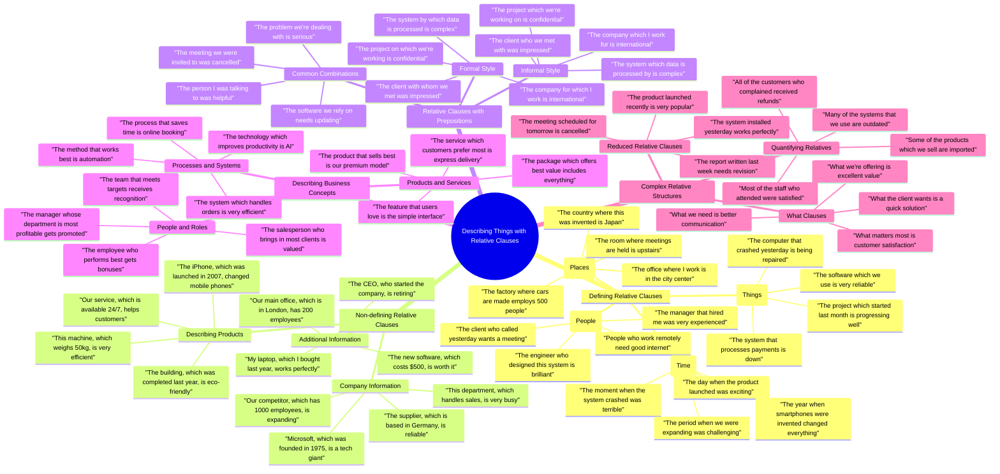

# Linkers of reason, result, and purpose

```mermaid
mindmap
  root((Linkers of Reason, Result, and Purpose))
    Reason/Cause Linkers
      Because/Since/As
        "We postponed the meeting because of the storm"
        "Since you're not available, we'll reschedule"
        "As the system is down, we can't process orders"
      Due to/Owing to
        "The delay was due to technical problems"
        "Owing to budget cuts, we reduced staff"
        "Due to high demand, we're hiring more people"
      Thanks to/Because of
        "Thanks to your help, we finished early"
        "Because of the new software, efficiency improved"
        "The success was thanks to teamwork"
      On Account of/As a Result of
        "On account of the weather, flights were canceled"
        "As a result of the merger, policies changed"
        "The meeting was moved on account of scheduling conflicts"
    
    Result/Consequence Linkers
      So/Therefore/Thus
        "The server crashed, so we lost data"
        "Sales increased; therefore, we need more staff"
        "The project failed, thus we learned valuable lessons"
      As a Result/Consequently
        "The campaign was successful. As a result, sales doubled"
        "We invested in training. Consequently, productivity improved"
        "The system updated. As a result, performance increased"
      Hence/Accordingly
        "Costs rose significantly, hence the price increase"
        "The policy changed; accordingly, procedures were updated"
        "Demand grew, hence we expanded operations"
      Such... that/So... that
        "The response was such that we extended the program"
        "It was so successful that we replicated it"
        "The demand was such that we couldn't meet it"
    
    Purpose Linkers
      To/In order to/So as to
        "We hired consultants to improve efficiency"
        "In order to reduce costs, we automated processes"
        "So as to meet deadlines, we worked overtime"
      So that/In order that
        "We updated the system so that it runs faster"
        "In order that everyone understands, I'll explain again"
        "We scheduled training so that staff learn new skills"
      For the purpose of/With a view to
        "For the purpose of expansion, we opened new offices"
        "With a view to improving service, we hired more staff"
        "The meeting was called for the purpose of planning"
      Aimed at/Designed to
        "The program is aimed at reducing waste"
        "This strategy is designed to increase profits"
        "The training is aimed at developing leadership skills"
    
    Complex Combinations
      Reason + Result
        "Because sales dropped, we had to cut costs"
        "Since the market changed, therefore we adapted"
        "Due to competition, as a result prices fell"
      Purpose + Result
        "To increase efficiency, we automated processes, so productivity improved"
        "In order to expand, we hired staff, consequently operations grew"
        "So as to improve quality, we trained employees, thus standards rose"
      Multiple Reasons
        "Due to both budget constraints and time pressure, we simplified the project"
        "Because of technical issues as well as staff shortage, we delayed launch"
        "Owing to market conditions and internal changes, we restructured"
```

```mermaid
mindmap
  root((Linkers of Contrast))
    Basic Contrast Linkers
      But/However/Yet
        "The product is expensive but high quality"
        "Sales dropped. However, profits remained stable"
        "The system is complex, yet easy to use"
      Although/Though/Even though
        "Although it's costly, it's worth the investment"
        "Though we're busy, we can meet the deadline"
        "Even though profits fell, we're still optimistic"
      While/Whereas
        "While sales increased, costs also rose"
        "Our team is small whereas theirs is large"
        "While I agree with the plan, I have concerns"
      Despite/In spite of
        "Despite the challenges, we succeeded"
        "In spite of budget cuts, quality remained high"
        "Despite working overtime, we missed the deadline"
    
    Formal Contrast Linkers
      Nevertheless/Nonetheless
        "The project failed. Nevertheless, we learned valuable lessons"
        "Costs increased. Nonetheless, we maintained profitability"
        "The system crashed. Nevertheless, we recovered quickly"
      On the contrary/On the other hand
        "It's not expensive. On the contrary, it's quite affordable"
        "Sales are up. On the other hand, expenses have risen"
        "The plan seems good. On the contrary, it has major flaws"
      Conversely/By contrast
        "Profits rose last year. Conversely, they fell this quarter"
        "Our service is fast. By contrast, theirs is slow"
        "We expanded. Conversely, our competitors downsized"
      Alternatively/Instead
        "We could hire more staff. Alternatively, we could outsource"
        "Instead of cutting costs, we increased investment"
        "Rather than delay, we decided to proceed"
    
    Concession Linkers
      Admittedly/Granted
        "Admittedly, the solution isn't perfect"
        "Granted, there are risks involved"
        "The plan has flaws, admittedly, but it's our best option"
      It's true that.../While it's true...
        "It's true that costs are high, but quality is excellent"
        "While it's true we're behind schedule, we can catch up"
        "True, the market is challenging, but opportunities exist"
      Even so/All the same
        "The project is risky. Even so, we should proceed"
        "Costs are high. All the same, it's worth doing"
        "The deadline is tight. Even so, we'll try to meet it"
    
    Unexpected Contrast
      Surprisingly/Unexpectedly
        "Surprisingly, sales increased during the recession"
        "Unexpectedly, the new system worked perfectly"
        "The meeting was short, surprisingly productive"
      Contrary to expectations
        "Contrary to expectations, the project finished early"
        "Against all odds, we achieved our targets"
        "Unlike predicted, the market responded positively"
      Ironically/Paradoxically
        "Ironically, cutting staff improved efficiency"
        "Paradoxically, spending more saved us money"
        "Strangely enough, the problem solved itself"
    
    Balanced Contrasts
      On one hand.../On the other hand
        "On one hand, it's expensive. On the other hand, it's durable"
        "On the one hand, we need growth. On the other, we need stability"
        "One advantage is speed. One disadvantage is cost"
      Both.../and yet
        "The system is both powerful and yet simple to use"
        "She's both experienced and yet open to new ideas"
        "The plan is both ambitious and yet realistic"
      Not only.../but also (contrast)
        "It's not only affordable but also high quality"
        "She's not only skilled but also very reliable"
        "The service is not only fast but also accurate"
```

```mermaid
mindmap
  root((Talking About Inventions - Passive Voice))
    When Inventions Were Made
      Past Simple Passive
        "The telephone was invented by Alexander Graham Bell"
        "The computer was developed in the 1940s"
        "The internet was created by Tim Berners-Lee"
        "Penicillin was discovered by Alexander Fleming"
      Time Expressions
        "The light bulb was invented in 1879"
        "Email was first used in the 1970s"
        "The smartphone was introduced in 2007"
        "Solar panels were developed during the 1950s"
      Unknown Inventors
        "The wheel was invented thousands of years ago"
        "Paper was first made in ancient China"
        "Glass was discovered by accident"
        "The compass was used by early sailors"
    
    How Inventions Are Made
      Present Simple Passive
        "New medicines are tested extensively"
        "Prototypes are built and evaluated"
        "Patents are filed to protect ideas"
        "Products are manufactured in factories"
      Process Description
        "Ideas are first researched and developed"
        "Designs are created using computer software"
        "Materials are selected for durability"
        "Quality is checked at every stage"
      Modern Innovation
        "AI technology is being advanced rapidly"
        "Electric cars are being improved constantly"
        "Renewable energy is being developed worldwide"
        "Medical devices are being made smaller"
    
    Impact of Inventions
      Present Perfect Passive
        "Lives have been transformed by smartphones"
        "Communication has been revolutionized by the internet"
        "Travel has been made easier by GPS"
        "Medicine has been improved by new technology"
      Ongoing Effects
        "Society has been changed by social media"
        "Work has been automated by machines"
        "Education has been enhanced by computers"
        "Entertainment has been digitized completely"
      Global Impact
        "Diseases have been eliminated by vaccines"
        "Distances have been shortened by air travel"
        "Information has been made accessible to everyone"
        "Barriers have been broken down by technology"
    
    Future Inventions
      Future Passive
        "New cures will be discovered soon"
        "Space travel will be made affordable"
        "Climate change will be addressed by innovation"
        "Artificial organs will be grown in labs"
      Predictions
        "Cars will be driven by computers"
        "Energy will be generated by fusion"
        "Food will be produced in vertical farms"
        "Diseases will be prevented before they start"
      Possibilities
        "Problems might be solved by AI"
        "Life could be extended significantly"
        "Work may be done entirely by robots"
        "Transportation could be revolutionized again"
    
    Describing Invention Features
      Physical Characteristics
        "It's made from lightweight materials"
        "The device is powered by solar energy"
        "Components are connected wirelessly"
        "The surface is coated with special materials"
      Functionality
        "Data is processed in real-time"
        "Information is stored in the cloud"
        "Users are connected instantly"
        "Problems are solved automatically"
      Benefits
        "Time is saved through automation"
        "Costs are reduced significantly"
        "Efficiency is improved dramatically"
        "Safety is enhanced by new features"
```

```mermaid
mindmap
  root((Describing Things with Relative Clauses))
    Defining Relative Clauses
      Who/That (People)
        "The engineer who designed this system is brilliant"
        "The manager that hired me was very experienced"
        "People who work remotely need good internet"
        "The client who called yesterday wants a meeting"
      Which/That (Things)
        "The software which we use is very reliable"
        "The computer that crashed yesterday is being repaired"
        "The project which started last month is progressing well"
        "The system that processes payments is down"
      Where (Places)
        "The office where I work is in the city center"
        "The factory where cars are made employs 500 people"
        "The room where meetings are held is upstairs"
        "The country where this was invented is Japan"
      When (Time)
        "The day when the product launched was exciting"
        "The year when smartphones were invented changed everything"
        "The moment when the system crashed was terrible"
        "The period when we were expanding was challenging"
    
    Non-defining Relative Clauses
      Additional Information
        "My laptop, which I bought last year, works perfectly"
        "The CEO, who started the company, is retiring"
        "Our main office, which is in London, has 200 employees"
        "The new software, which costs $500, is worth it"
      Describing Products
        "The iPhone, which was launched in 2007, changed mobile phones"
        "This machine, which weighs 50kg, is very efficient"
        "Our service, which is available 24/7, helps customers"
        "The building, which was completed last year, is eco-friendly"
      Company Information
        "Microsoft, which was founded in 1975, is a tech giant"
        "Our competitor, which has 1000 employees, is expanding"
        "The supplier, which is based in Germany, is reliable"
        "This department, which handles sales, is very busy"
    
    Relative Clauses with Prepositions
      Formal Style
        "The company for which I work is international"
        "The project on which we're working is confidential"
        "The client with whom we met was impressed"
        "The system by which data is processed is complex"
      Informal Style
        "The company which I work for is international"
        "The project which we're working on is confidential"
        "The client who we met with was impressed"
        "The system which data is processed by is complex"
      Common Combinations
        "The problem we're dealing with is serious"
        "The person I was talking to was helpful"
        "The meeting we were invited to was cancelled"
        "The software we rely on needs updating"
    
    Describing Business Concepts
      Products and Services
        "The product that sells best is our premium model"
        "The service which customers prefer most is express delivery"
        "The feature that users love is the simple interface"
        "The package which offers best value includes everything"
      Processes and Systems
        "The method that works best is automation"
        "The system which handles orders is very efficient"
        "The process that saves time is online booking"
        "The technology which improves productivity is AI"
      People and Roles
        "The employee who performs best gets bonuses"
        "The team that meets targets receives recognition"
        "The manager whose department is most profitable gets promoted"
        "The salesperson who brings in most clients is valued"
    
    Complex Relative Structures
      Reduced Relative Clauses
        "The report written last week needs revision"
        "The meeting scheduled for tomorrow is cancelled"
        "The product launched recently is very popular"
        "The system installed yesterday works perfectly"
      What Clauses
        "What we need is better communication"
        "What matters most is customer satisfaction"
        "What the client wants is a quick solution"
        "What we're offering is excellent value"
      Quantifying Relatives
        "Most of the staff who attended were satisfied"
        "Some of the products which we sell are imported"
        "All of the customers who complained received refunds"
        "Many of the systems that we use are outdated"
```
