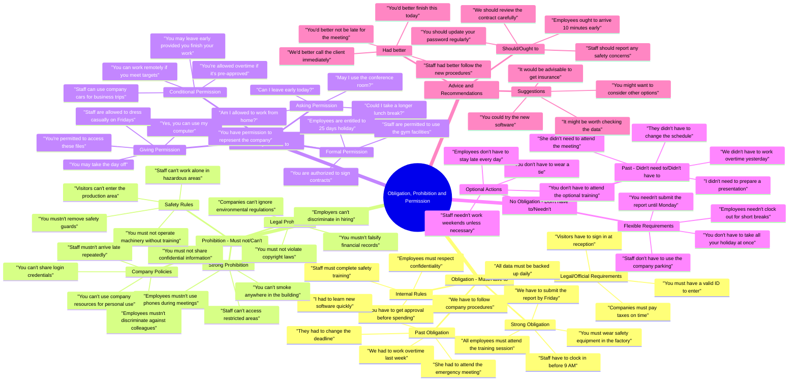

# Obligation, Prohibition and Permission

```mermaid
mindmap
  root((Obligation, Prohibition and Permission))
    Obligation - Must/Have to
      Strong Obligation
        "You must wear safety equipment in the factory"
        "All employees must attend the training session"
        "We have to submit the report by Friday"
        "Staff have to clock in before 9 AM"
      Legal/Official Requirements
        "Companies must pay taxes on time"
        "Visitors have to sign in at reception"
        "You must have a valid ID to enter"
        "All data must be backed up daily"
      Internal Rules
        "We have to follow company procedures"
        "Employees must respect confidentiality"
        "You have to get approval before spending"
        "Staff must complete safety training"
      Past Obligation
        "We had to work overtime last week"
        "She had to attend the emergency meeting"
        "They had to change the deadline"
        "I had to learn new software quickly"
    
    Prohibition - Must not/Can't
      Strong Prohibition
        "You must not share confidential information"
        "Employees mustn't use phones during meetings"
        "You can't smoke anywhere in the building"
        "Staff can't access restricted areas"
      Safety Rules
        "You must not operate machinery without training"
        "Visitors can't enter the production area"
        "You mustn't remove safety guards"
        "Staff can't work alone in hazardous areas"
      Company Policies
        "You can't use company resources for personal use"
        "Employees mustn't discriminate against colleagues"
        "You can't share login credentials"
        "Staff mustn't arrive late repeatedly"
      Legal Prohibitions
        "Companies can't ignore environmental regulations"
        "You mustn't falsify financial records"
        "Employers can't discriminate in hiring"
        "You must not violate copyright laws"
    
    Permission - Can/May/Allowed to
      Asking Permission
        "Can I leave early today?"
        "May I use the conference room?"
        "Am I allowed to work from home?"
        "Could I take a longer lunch break?"
      Giving Permission
        "Yes, you can use my computer"
        "You may take the day off"
        "Staff are allowed to dress casually on Fridays"
        "You're permitted to access these files"
      Formal Permission
        "You are authorized to sign contracts"
        "Employees are entitled to 25 days holiday"
        "You have permission to represent the company"
        "Staff are permitted to use the gym facilities"
      Conditional Permission
        "You can work remotely if you meet targets"
        "You may leave early provided you finish your work"
        "Staff can use company cars for business trips"
        "You're allowed overtime if it's pre-approved"
    
    No Obligation - Don't have to/Needn't
      Optional Actions
        "You don't have to attend the optional training"
        "Staff needn't work weekends unless necessary"
        "You don't have to wear a tie"
        "Employees don't have to stay late every day"
      Flexible Requirements
        "You needn't submit the report until Monday"
        "Staff don't have to use the company parking"
        "You don't have to take all your holiday at once"
        "Employees needn't clock out for short breaks"
      Past - Didn't need to/Didn't have to
        "We didn't have to work overtime yesterday"
        "She didn't need to attend the meeting"
        "They didn't have to change the schedule"
        "I didn't need to prepare a presentation"
    
    Advice and Recommendations
      Should/Ought to
        "You should update your password regularly"
        "Employees ought to arrive 10 minutes early"
        "We should review the contract carefully"
        "Staff should report any safety concerns"
      Had better
        "You'd better finish this today"
        "We'd better call the client immediately"
        "Staff had better follow the new procedures"
        "You'd better not be late for the meeting"
      Suggestions
        "You might want to consider other options"
        "It would be advisable to get insurance"
        "You could try the new software"
        "It might be worth checking the data"
```

```mermaid
mindmap
  root((Security at Work))
    Physical Security
      Access Control
        "You must show your ID badge to enter"
        "Visitors have to sign in at reception"
        "All doors are locked after 6 PM"
        "Security cameras monitor the premises"
      Building Security
        "The building has 24/7 security guards"
        "Fire exits must remain unlocked during work hours"
        "You can't prop doors open for security reasons"
        "Alarm systems are activated at night"
      Personal Safety
        "Staff must wear safety equipment in the warehouse"
        "You should report any suspicious activity"
        "Emergency procedures are posted on every floor"
        "First aid kits are located in each department"
      Visitor Management
        "All visitors must be escorted by an employee"
        "Guest passes are required for non-employees"
        "Contractors need security clearance"
        "Delivery personnel can only access loading areas"
    
    Information Security
      Data Protection
        "You must not share login credentials"
        "Confidential files should be password protected"
        "Personal data must be handled according to GDPR"
        "Sensitive documents can't be left on desks"
      Computer Security
        "You have to update your password monthly"
        "USB drives from outside aren't allowed"
        "Software must be approved by IT before installation"
        "You should log out when leaving your workstation"
      Email and Internet
        "Personal emails shouldn't be sent from work accounts"
        "You can't download unauthorized software"
        "Suspicious emails must be reported to IT"
        "Social media use is restricted during work hours"
      Document Security
        "Confidential papers must be shredded"
        "You're not allowed to photocopy sensitive documents"
        "Files should be locked in cabinets overnight"
        "Clean desk policy must be followed"
    
    Workplace Policies
      Confidentiality
        "Employees must sign non-disclosure agreements"
        "You can't discuss client information publicly"
        "Trade secrets are protected by law"
        "Confidential meetings require signed agreements"
      Compliance Requirements
        "All staff must complete security training annually"
        "You have to report security incidents immediately"
        "Background checks are required for certain positions"
        "Regular security audits are conducted"
      Personal Conduct
        "You mustn't bring unauthorized people into the office"
        "Personal belongings should be secured"
        "You can't use company equipment for personal business"
        "Professional behavior is expected at all times"
    
    Emergency Procedures
      Fire Safety
        "Fire drills are conducted monthly"
        "You must evacuate immediately when alarms sound"
        "Fire extinguishers are located on every floor"
        "Emergency exits should never be blocked"
      Medical Emergencies
        "First aid trained staff are available on each floor"
        "You should call emergency services for serious injuries"
        "Accident report forms must be completed"
        "Medical information is kept confidential"
      Security Incidents
        "Theft must be reported to security immediately"
        "You should never confront suspicious individuals"
        "All incidents are investigated thoroughly"
        "Security footage may be reviewed if necessary"
      Business Continuity
        "Backup systems are tested regularly"
        "Emergency contact lists are updated quarterly"
        "Alternative work locations are available"
        "Critical operations have contingency plans"
    
    Technology Security
      Cybersecurity
        "Firewalls protect our network from attacks"
        "Antivirus software is updated automatically"
        "You must report phishing attempts"
        "Two-factor authentication is required"
      Mobile Device Security
        "Company phones have security software installed"
        "Personal devices need approval to access company data"
        "Lost devices must be reported immediately"
        "Remote wiping capability is available"
      Cloud Security
        "Data is encrypted when stored in the cloud"
        "Access permissions are regularly reviewed"
        "You can only use approved cloud services"
        "Backup data is stored securely offsite"
```

```mermaid
mindmap
  root((Talking About Security Issues))
    Identifying Security Problems
      Common Issues
        "We've detected a security breach in the system"
        "There's been unauthorized access to confidential files"
        "Someone has been using fake credentials"
        "The firewall has been compromised"
      Reporting Problems
        "I need to report a security incident"
        "There's suspicious activity on the network"
        "I think my password has been compromised"
        "We've noticed unusual login attempts"
      Describing Incidents
        "The breach occurred last night around midnight"
        "Hackers gained access through a phishing email"
        "Sensitive data may have been stolen"
        "The attack lasted for several hours"
      Impact Assessment
        "Customer data has been exposed"
        "Financial information might be at risk"
        "Our reputation could be damaged"
        "Business operations have been disrupted"
    
    Discussing Vulnerabilities
      System Weaknesses
        "Our password policy is too weak"
        "The software hasn't been updated recently"
        "There are gaps in our security coverage"
        "Some employees lack security awareness"
      Risk Factors
        "Remote work increases security risks"
        "Old systems are more vulnerable to attacks"
        "Unsecured Wi-Fi networks pose threats"
        "Human error is our biggest weakness"
      Potential Threats
        "Cybercriminals are targeting our industry"
        "Malware could infect our computers"
        "Phishing attacks are becoming more sophisticated"
        "Insider threats are a growing concern"
      Warning Signs
        "The system is running slower than usual"
        "There are unexpected pop-up messages"
        "Files have been mysteriously deleted"
        "Network traffic patterns look unusual"
    
    Responding to Security Issues
      Immediate Actions
        "We need to isolate the affected systems"
        "All passwords should be changed immediately"
        "The incident response team has been activated"
        "We're conducting a full security audit"
      Investigation Process
        "Forensic experts are analyzing the breach"
        "We're reviewing security logs and footage"
        "The police have been notified about the incident"
        "External security consultants are helping us"
      Communication
        "We must inform affected customers immediately"
        "The board needs to be briefed on the situation"
        "A press release will be issued this afternoon"
        "Legal requirements for disclosure must be met"
      Recovery Measures
        "Systems are being restored from clean backups"
        "Additional security measures are being implemented"
        "Staff will receive emergency security training"
        "We're upgrading our security infrastructure"
    
    Prevention and Solutions
      Security Improvements
        "We need to strengthen our firewall protection"
        "Multi-factor authentication should be mandatory"
        "Regular security training is essential"
        "Access controls need to be tightened"
      Policy Changes
        "The security policy requires immediate updating"
        "New procedures for handling sensitive data"
        "Stricter rules for remote access"
        "Enhanced background checks for new employees"
      Technology Solutions
        "We're investing in advanced threat detection"
        "Encryption will be applied to all sensitive data"
        "Security monitoring will be increased"
        "Automated backup systems are being installed"
      Training and Awareness
        "All staff must complete security awareness training"
        "Regular phishing simulation exercises"
        "Security reminders will be sent monthly"
        "Incident reporting procedures need clarification"
    
    Discussing Consequences
      Financial Impact
        "The breach could cost millions in damages"
        "Insurance may cover some of the losses"
        "Legal fees are expected to be substantial"
        "Revenue loss due to system downtime"
      Legal Implications
        "We may face regulatory fines"
        "Customers could file lawsuits against us"
        "Compliance violations need to be addressed"
        "Data protection authorities are investigating"
      Reputation Damage
        "Customer trust has been severely damaged"
        "Media coverage has been largely negative"
        "Competitors are gaining market advantage"
        "Recovery will take months or years"
      Operational Effects
        "Business processes have been disrupted"
        "Employee productivity has decreased"
        "Customer service has been affected"
        "Future projects may be delayed"
```
