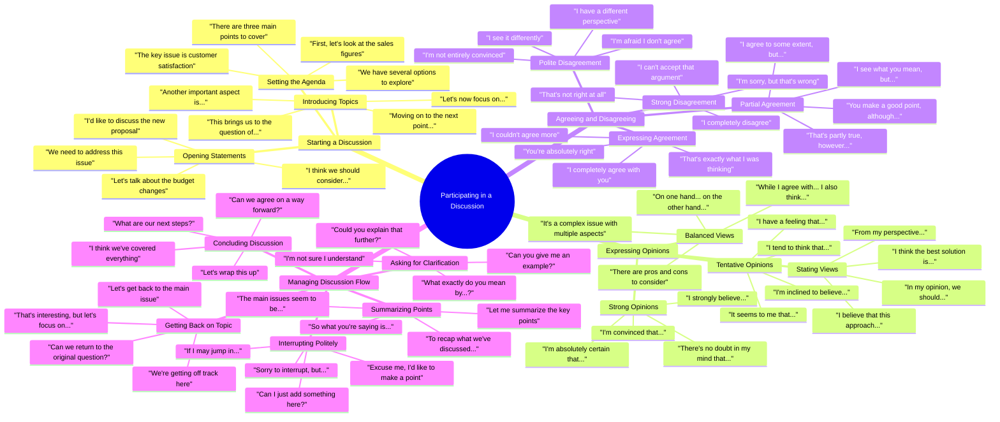
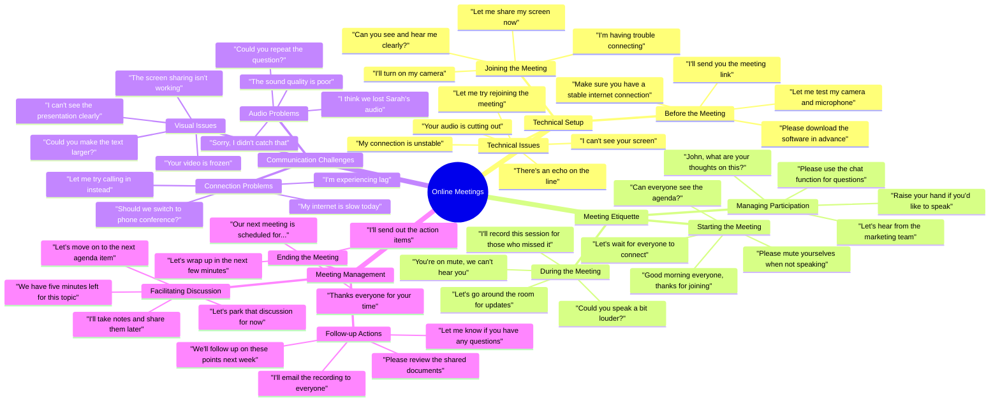

# Participating in a discussion

```mermaid
mindmap
  root((Participating in a Discussion))
    Starting a Discussion
      Opening Statements
        "I'd like to discuss the new proposal"
        "Let's talk about the budget changes"
        "We need to address this issue"
        "I think we should consider..."
      Setting the Agenda
        "First, let's look at the sales figures"
        "There are three main points to cover"
        "The key issue is customer satisfaction"
        "We have several options to explore"
      Introducing Topics
        "Moving on to the next point..."
        "Another important aspect is..."
        "This brings us to the question of..."
        "Let's now focus on..."
    
    Expressing Opinions
      Stating Views
        "In my opinion, we should..."
        "I believe that this approach..."
        "From my perspective..."
        "I think the best solution is..."
      Strong Opinions
        "I'm convinced that..."
        "I strongly believe..."
        "There's no doubt in my mind that..."
        "I'm absolutely certain that..."
      Tentative Opinions
        "I tend to think that..."
        "It seems to me that..."
        "I'm inclined to believe..."
        "I have a feeling that..."
      Balanced Views
        "On one hand... on the other hand..."
        "While I agree with... I also think..."
        "There are pros and cons to consider"
        "It's a complex issue with multiple aspects"
    
    Agreeing and Disagreeing
      Expressing Agreement
        "I completely agree with you"
        "That's exactly what I was thinking"
        "You're absolutely right"
        "I couldn't agree more"
      Partial Agreement
        "I agree to some extent, but..."
        "That's partly true, however..."
        "You make a good point, although..."
        "I see what you mean, but..."
      Polite Disagreement
        "I'm afraid I don't agree"
        "I see it differently"
        "I'm not entirely convinced"
        "I have a different perspective"
      Strong Disagreement
        "I completely disagree"
        "That's not right at all"
        "I'm sorry, but that's wrong"
        "I can't accept that argument"
    
    Managing Discussion Flow
      Interrupting Politely
        "Sorry to interrupt, but..."
        "Can I just add something here?"
        "If I may jump in..."
        "Excuse me, I'd like to make a point"
      Getting Back on Topic
        "Let's get back to the main issue"
        "We're getting off track here"
        "Can we return to the original question?"
        "That's interesting, but let's focus on..."
      Asking for Clarification
        "Could you explain that further?"
        "What exactly do you mean by...?"
        "I'm not sure I understand"
        "Can you give me an example?"
      Summarizing Points
        "So what you're saying is..."
        "Let me summarize the key points"
        "To recap what we've discussed..."
        "The main issues seem to be..."
      Concluding Discussion
        "I think we've covered everything"
        "Let's wrap this up"
        "What are our next steps?"
        "Can we agree on a way forward?"
```

```mermaid
mindmap
  root((Online Meetings))
    Technical Setup
      Before the Meeting
        "Let me test my camera and microphone"
        "I'll send you the meeting link"
        "Please download the software in advance"
        "Make sure you have a stable internet connection"
      Joining the Meeting
        "I'm having trouble connecting"
        "Can you see and hear me clearly?"
        "Let me share my screen now"
        "I'll turn on my camera"
      Technical Issues
        "Your audio is cutting out"
        "I can't see your screen"
        "There's an echo on the line"
        "My connection is unstable"
        "Let me try rejoining the meeting"
    
    Meeting Etiquette
      Starting the Meeting
        "Good morning everyone, thanks for joining"
        "Let's wait for everyone to connect"
        "Can everyone see the agenda?"
        "Please mute yourselves when not speaking"
      During the Meeting
        "You're on mute, we can't hear you"
        "Could you speak a bit louder?"
        "Let's go around the room for updates"
        "I'll record this session for those who missed it"
      Managing Participation
        "John, what are your thoughts on this?"
        "Let's hear from the marketing team"
        "Please use the chat function for questions"
        "Raise your hand if you'd like to speak"
    
    Communication Challenges
      Audio Problems
        "Sorry, I didn't catch that"
        "Could you repeat the question?"
        "The sound quality is poor"
        "I think we lost Sarah's audio"
      Visual Issues
        "Your video is frozen"
        "I can't see the presentation clearly"
        "The screen sharing isn't working"
        "Could you make the text larger?"
      Connection Problems
        "I'm experiencing lag"
        "My internet is slow today"
        "Let me try calling in instead"
        "Should we switch to phone conference?"
    
    Meeting Management
      Facilitating Discussion
        "Let's move on to the next agenda item"
        "We have five minutes left for this topic"
        "I'll take notes and share them later"
        "Let's park that discussion for now"
      Ending the Meeting
        "Let's wrap up in the next few minutes"
        "I'll send out the action items"
        "Thanks everyone for your time"
        "Our next meeting is scheduled for..."
      Follow-up Actions
        "I'll email the recording to everyone"
        "Please review the shared documents"
        "Let me know if you have any questions"
        "We'll follow up on these points next week"
```
