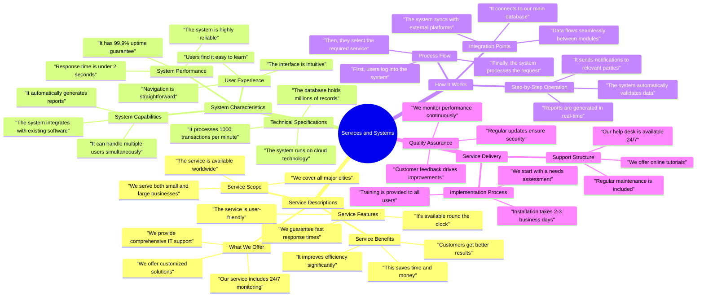
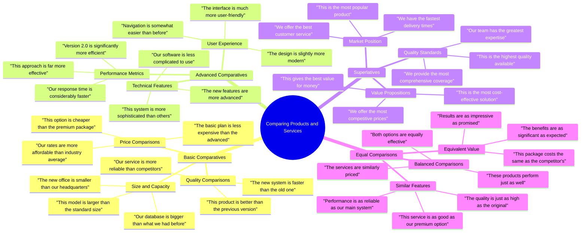
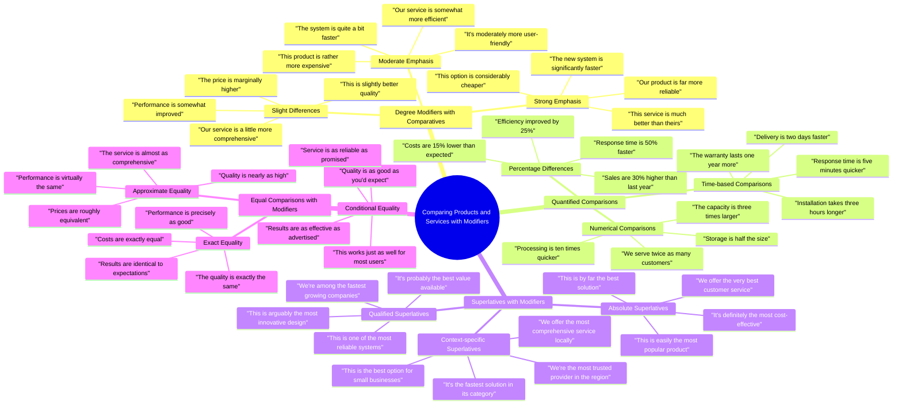
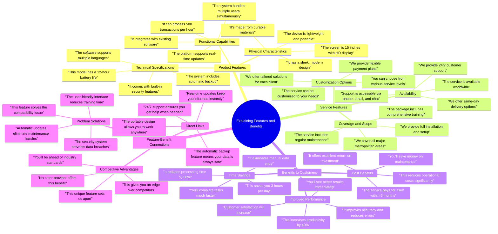

# Services and Systems

```mermaid
mindmap
  root((Services and Systems))
    Service Descriptions
      What We Offer
        "We provide comprehensive IT support"
        "Our service includes 24/7 monitoring"
        "We offer customized solutions"
      Service Features
        "The service is user-friendly"
        "It's available round the clock"
        "We guarantee fast response times"
      Service Benefits
        "This saves time and money"
        "It improves efficiency significantly"
        "Customers get better results"
      Service Scope
        "We cover all major cities"
        "The service is available worldwide"
        "We serve both small and large businesses"
    
    System Characteristics
      Technical Specifications
        "The system runs on cloud technology"
        "It processes 1000 transactions per minute"
        "The database holds millions of records"
      System Capabilities
        "It can handle multiple users simultaneously"
        "The system integrates with existing software"
        "It automatically generates reports"
      System Performance
        "The system is highly reliable"
        "Response time is under 2 seconds"
        "It has 99.9% uptime guarantee"
      User Experience
        "The interface is intuitive"
        "Navigation is straightforward"
        "Users find it easy to learn"
    
    How It Works
      Process Flow
        "First, users log into the system"
        "Then, they select the required service"
        "Finally, the system processes the request"
      Step-by-Step Operation
        "The system automatically validates data"
        "It sends notifications to relevant parties"
        "Reports are generated in real-time"
      Integration Points
        "It connects to our main database"
        "The system syncs with external platforms"
        "Data flows seamlessly between modules"
    
    Service Delivery
      Implementation Process
        "We start with a needs assessment"
        "Installation takes 2-3 business days"
        "Training is provided to all users"
      Support Structure
        "Our help desk is available 24/7"
        "We offer online tutorials"
        "Regular maintenance is included"
      Quality Assurance
        "We monitor performance continuously"
        "Regular updates ensure security"
        "Customer feedback drives improvements"
```

```mermaid
mindmap
  root((Comparing Products and Services))
    Basic Comparatives
      Quality Comparisons
        "This product is better than the previous version"
        "Our service is more reliable than competitors"
        "The new system is faster than the old one"
      Price Comparisons
        "This option is cheaper than the premium package"
        "Our rates are more affordable than industry average"
        "The basic plan is less expensive than the advanced"
      Size and Capacity
        "This model is larger than the standard size"
        "Our database is bigger than what we had before"
        "The new office is smaller than our headquarters"
    
    Advanced Comparatives
      Performance Metrics
        "Version 2.0 is significantly more efficient"
        "Our response time is considerably faster"
        "This approach is far more effective"
      User Experience
        "The interface is much more user-friendly"
        "Navigation is somewhat easier than before"
        "The design is slightly more modern"
      Technical Features
        "This system is more sophisticated than others"
        "Our software is less complicated to use"
        "The new features are more advanced"
    
    Superlatives
      Market Position
        "We offer the best customer service"
        "This is the most popular product"
        "We have the fastest delivery times"
      Quality Standards
        "This is the highest quality available"
        "We provide the most comprehensive coverage"
        "Our team has the greatest expertise"
      Value Propositions
        "This gives the best value for money"
        "We offer the most competitive prices"
        "This is the most cost-effective solution"
    
    Equal Comparisons
      Similar Features
        "This service is as good as our premium option"
        "The quality is just as high as the original"
        "Performance is as reliable as our main system"
      Equivalent Value
        "This package costs the same as the competitor's"
        "The benefits are as significant as expected"
        "Results are as impressive as promised"
      Balanced Comparisons
        "Both options are equally effective"
        "The services are similarly priced"
        "These products perform just as well"
```

```mermaid
mindmap
  root((Comparing Products and Services with Modifiers))
    Degree Modifiers with Comparatives
      Strong Emphasis
        "This service is much better than theirs"
        "Our product is far more reliable"
        "The new system is significantly faster"
        "This option is considerably cheaper"
      Moderate Emphasis
        "Our service is somewhat more efficient"
        "This product is rather more expensive"
        "The system is quite a bit faster"
        "It's moderately more user-friendly"
      Slight Differences
        "This is slightly better quality"
        "Our service is a little more comprehensive"
        "The price is marginally higher"
        "Performance is somewhat improved"
    
    Quantified Comparisons
      Percentage Differences
        "Sales are 30% higher than last year"
        "Costs are 15% lower than expected"
        "Efficiency improved by 25%"
        "Response time is 50% faster"
      Numerical Comparisons
        "We serve twice as many customers"
        "The capacity is three times larger"
        "Processing is ten times quicker"
        "Storage is half the size"
      Time-based Comparisons
        "Delivery is two days faster"
        "Installation takes three hours longer"
        "Response time is five minutes quicker"
        "The warranty lasts one year more"
    
    Superlatives with Modifiers
      Absolute Superlatives
        "This is by far the best solution"
        "We offer the very best customer service"
        "This is easily the most popular product"
        "It's definitely the most cost-effective"
      Qualified Superlatives
        "This is one of the most reliable systems"
        "We're among the fastest growing companies"
        "It's probably the best value available"
        "This is arguably the most innovative design"
      Context-specific Superlatives
        "This is the best option for small businesses"
        "We're the most trusted provider in the region"
        "It's the fastest solution in its category"
        "We offer the most comprehensive service locally"
    
    Equal Comparisons with Modifiers
      Exact Equality
        "The quality is exactly the same"
        "Performance is precisely as good"
        "Costs are exactly equal"
        "Results are identical to expectations"
      Approximate Equality
        "The service is almost as comprehensive"
        "Quality is nearly as high"
        "Performance is virtually the same"
        "Prices are roughly equivalent"
      Conditional Equality
        "This works just as well for most users"
        "Quality is as good as you'd expect"
        "Service is as reliable as promised"
        "Results are as effective as advertised"
```

```mermaid
mindmap
  root((Explaining Features and Benefits))
    Product Features
      Technical Specifications
        "This model has a 12-hour battery life"
        "The system includes automatic backup"
        "It comes with built-in security features"
        "The software supports multiple languages"
      Physical Characteristics
        "The device is lightweight and portable"
        "It has a sleek, modern design"
        "The screen is 15 inches with HD display"
        "It's made from durable materials"
      Functional Capabilities
        "It can process 500 transactions per hour"
        "The system handles multiple users simultaneously"
        "It integrates with existing software"
        "The platform supports real-time updates"
    
    Service Features
      Availability
        "We provide 24/7 customer support"
        "The service is available worldwide"
        "We offer same-day delivery options"
        "Support is accessible via phone, email, and chat"
      Coverage and Scope
        "We cover all major metropolitan areas"
        "The package includes comprehensive training"
        "We provide full installation and setup"
        "The service includes regular maintenance"
      Customization Options
        "We offer tailored solutions for each client"
        "The service can be customized to your needs"
        "We provide flexible payment plans"
        "You can choose from various service levels"
    
    Benefits to Customers
      Time Savings
        "This saves you 3 hours per day"
        "It reduces processing time by 50%"
        "You'll complete tasks much faster"
        "It eliminates manual data entry"
      Cost Benefits
        "This reduces operational costs significantly"
        "You'll save money on maintenance"
        "It offers excellent return on investment"
        "The service pays for itself within 6 months"
      Improved Performance
        "This increases productivity by 40%"
        "You'll see better results immediately"
        "It improves accuracy and reduces errors"
        "Customer satisfaction will increase"
    
    Feature-Benefit Connections
      Direct Links
        "The automatic backup feature means your data is always safe"
        "24/7 support ensures you get help when needed"
        "The portable design allows you to work anywhere"
        "Real-time updates keep you informed instantly"
      Problem Solutions
        "This feature solves the compatibility issue"
        "The security system prevents data breaches"
        "Automatic updates eliminate maintenance hassles"
        "The user-friendly interface reduces training time"
      Competitive Advantages
        "This unique feature sets us apart"
        "No other provider offers this benefit"
        "This gives you an edge over competitors"
        "You'll be ahead of industry standards"
```
