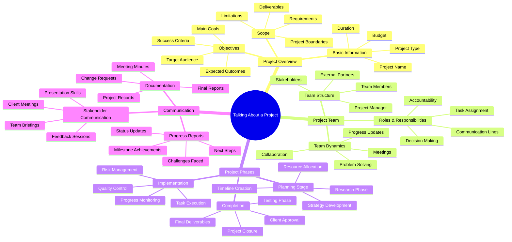
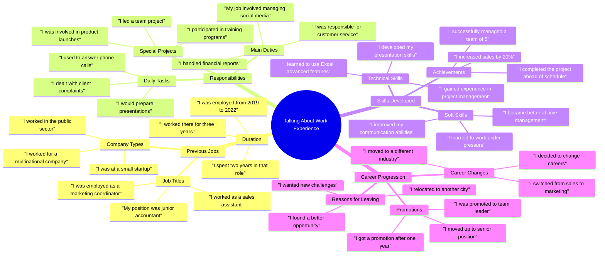
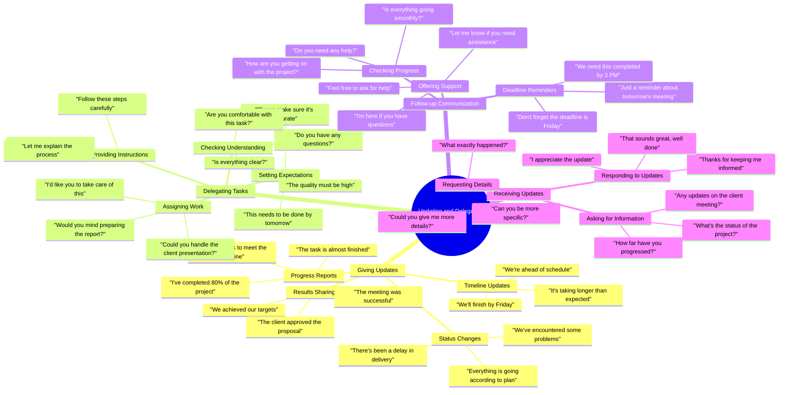

# Talking about a project

```mermaid
mindmap
  root((Talking About a Project))
    Project Overview
      Basic Information
        Project Name
        Project Type
        Duration
        Budget
      Objectives
        Main Goals
        Expected Outcomes
        Success Criteria
        Target Audience
      Scope
        Project Boundaries
        Deliverables
        Requirements
        Limitations
    
    Project Team
      Team Structure
        Project Manager
        Team Members
        Stakeholders
        External Partners
      Roles & Responsibilities
        Task Assignment
        Decision Making
        Communication Lines
        Accountability
      Team Dynamics
        Collaboration
        Meetings
        Progress Updates
        Problem Solving
    
    Project Phases
      Planning Stage
        Research Phase
        Strategy Development
        Resource Allocation
        Timeline Creation
      Implementation
        Task Execution
        Progress Monitoring
        Quality Control
        Risk Management
      Completion
        Final Deliverables
        Testing Phase
        Client Approval
        Project Closure
    
    Communication
      Progress Reports
        Status Updates
        Milestone Achievements
        Challenges Faced
        Next Steps
      Stakeholder Communication
        Client Meetings
        Team Briefings
        Presentation Skills
        Feedback Sessions
      Documentation
        Project Records
        Meeting Minutes
        Change Requests
        Final Reports
```

```mermaid
mindmap
  root((Talking About Work Experience))
    Previous Jobs
      Job Titles
        "I worked as a sales assistant"
        "I was employed as a marketing coordinator"
        "My position was junior accountant"
      Company Types
        "I worked for a multinational company"
        "I was at a small startup"
        "I worked in the public sector"
      Duration
        "I worked there for three years"
        "I was employed from 2019 to 2022"
        "I spent two years in that role"
    
    Responsibilities
      Main Duties
        "I was responsible for customer service"
        "My job involved managing social media"
        "I handled financial reports"
      Daily Tasks
        "I used to answer phone calls"
        "I would prepare presentations"
        "I dealt with client complaints"
      Special Projects
        "I led a team project"
        "I was involved in product launches"
        "I participated in training programs"
    
    Skills Developed
      Technical Skills
        "I learned to use Excel advanced features"
        "I gained experience in project management"
        "I developed my presentation skills"
      Soft Skills
        "I improved my communication abilities"
        "I became better at time management"
        "I learned to work under pressure"
      Achievements
        "I increased sales by 20%"
        "I successfully managed a team of 5"
        "I completed the project ahead of schedule"
    
    Career Progression
      Promotions
        "I was promoted to team leader"
        "I moved up to senior position"
        "I got a promotion after one year"
      Career Changes
        "I decided to change careers"
        "I moved to a different industry"
        "I switched from sales to marketing"
      Reasons for Leaving
        "I wanted new challenges"
        "I relocated to another city"
        "I found a better opportunity"
```

```mermaid
mindmap
  root((Updating and Delegating Tasks))
    Giving Updates
      Progress Reports
        "I've completed 80% of the project"
        "We're on track to meet the deadline"
        "The task is almost finished"
      Status Changes
        "There's been a delay in delivery"
        "We've encountered some problems"
        "Everything is going according to plan"
      Timeline Updates
        "We'll finish by Friday"
        "It's taking longer than expected"
        "We're ahead of schedule"
      Results Sharing
        "The meeting was successful"
        "We achieved our targets"
        "The client approved the proposal"
    
    Delegating Tasks
      Assigning Work
        "Could you handle the client presentation?"
        "I'd like you to take care of this"
        "Would you mind preparing the report?"
      Setting Expectations
        "This needs to be done by tomorrow"
        "Please make sure it's accurate"
        "The quality must be high"
      Providing Instructions
        "Here's what you need to do"
        "Follow these steps carefully"
        "Let me explain the process"
      Checking Understanding
        "Do you have any questions?"
        "Is everything clear?"
        "Are you comfortable with this task?"
    
    Follow-up Communication
      Checking Progress
        "How are you getting on with the project?"
        "Do you need any help?"
        "Is everything going smoothly?"
      Offering Support
        "Let me know if you need assistance"
        "I'm here if you have questions"
        "Feel free to ask for help"
      Deadline Reminders
        "Don't forget the deadline is Friday"
        "Just a reminder about tomorrow's meeting"
        "We need this completed by 3 PM"
    
    Receiving Updates
      Asking for Information
        "What's the status of the project?"
        "How far have you progressed?"
        "Any updates on the client meeting?"
      Responding to Updates
        "Thanks for keeping me informed"
        "That sounds great, well done"
        "I appreciate the update"
      Requesting Details
        "Could you give me more details?"
        "What exactly happened?"
        "Can you be more specific?"
```
