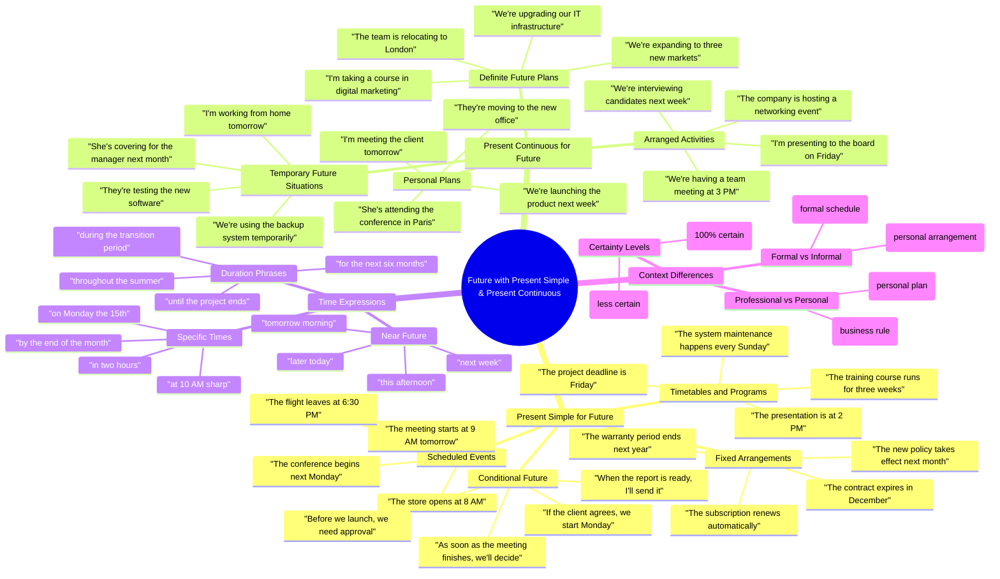
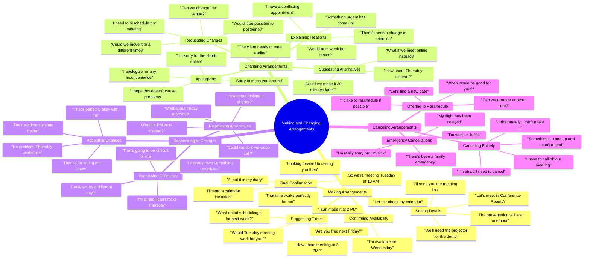
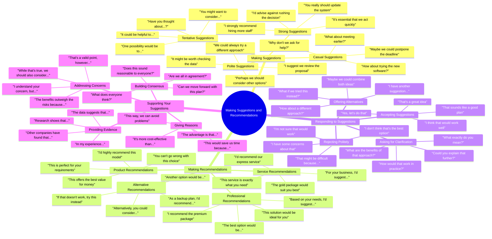

# Talking about the future using Present Simple and Present Continuous

```mermaid
mindmap
  root((Future with Present Simple & Present Continuous))
    Present Simple for Future
      Scheduled Events
        "The meeting starts at 9 AM tomorrow"
        "The flight leaves at 6:30 PM"
        "The conference begins next Monday"
        "The store opens at 8 AM"
      Timetables and Programs
        "The training course runs for three weeks"
        "The project deadline is Friday"
        "The presentation is at 2 PM"
        "The system maintenance happens every Sunday"
      Fixed Arrangements
        "The new policy takes effect next month"
        "The contract expires in December"
        "The warranty period ends next year"
        "The subscription renews automatically"
      Conditional Future
        "If the client agrees, we start Monday"
        "When the report is ready, I'll send it"
        "As soon as the meeting finishes, we'll decide"
        "Before we launch, we need approval"
    
    Present Continuous for Future
      Personal Plans
        "I'm meeting the client tomorrow"
        "We're launching the product next week"
        "She's attending the conference in Paris"
        "They're moving to the new office"
      Arranged Activities
        "We're having a team meeting at 3 PM"
        "I'm presenting to the board on Friday"
        "The company is hosting a networking event"
        "We're interviewing candidates next week"
      Temporary Future Situations
        "I'm working from home tomorrow"
        "We're using the backup system temporarily"
        "She's covering for the manager next month"
        "They're testing the new software"
      Definite Future Plans
        "We're expanding to three new markets"
        "I'm taking a course in digital marketing"
        "The team is relocating to London"
        "We're upgrading our IT infrastructure"
    
    Time Expressions
      Near Future
        "tomorrow morning"
        "next week"
        "this afternoon"
        "later today"
      Specific Times
        "at 10 AM sharp"
        "on Monday the 15th"
        "in two hours"
        "by the end of the month"
      Duration Phrases
        "for the next six months"
        "until the project ends"
        "throughout the summer"
        "during the transition period"
    
    Context Differences
      Formal vs Informal
        "The board meets Tuesday" (formal schedule)
        "I'm seeing the boss Tuesday" (personal arrangement)
      Certainty Levels
        "The system updates at midnight" (100% certain)
        "We're probably meeting tomorrow" (less certain)
      Professional vs Personal
        "The office closes at 5 PM" (business rule)
        "I'm leaving early today" (personal plan)
```

```mermaid
mindmap
  root((Making and Changing Arrangements))
    Making Arrangements
      Suggesting Times
        "How about meeting at 3 PM?"
        "Would Tuesday morning work for you?"
        "Are you free next Friday?"
        "What about scheduling it for next week?"
      Confirming Availability
        "Let me check my calendar"
        "I'm available on Wednesday"
        "That time works perfectly for me"
        "I can make it at 2 PM"
      Setting Details
        "Let's meet in Conference Room A"
        "I'll send you the meeting link"
        "The presentation will last one hour"
        "We'll need the projector for the demo"
      Final Confirmation
        "So we're meeting Tuesday at 10 AM"
        "I'll put it in my diary"
        "Looking forward to seeing you then"
        "I'll send a calendar invitation"
    
    Changing Arrangements
      Requesting Changes
        "I need to reschedule our meeting"
        "Could we move it to a different time?"
        "Would it be possible to postpone?"
        "Can we change the venue?"
      Explaining Reasons
        "Something urgent has come up"
        "I have a conflicting appointment"
        "The client needs to meet earlier"
        "There's been a change in priorities"
      Suggesting Alternatives
        "How about Thursday instead?"
        "Could we make it 30 minutes later?"
        "What if we meet online instead?"
        "Would next week be better?"
      Apologizing
        "I'm sorry for the short notice"
        "I apologize for any inconvenience"
        "Sorry to mess you around"
        "I hope this doesn't cause problems"
    
    Responding to Changes
      Accepting Changes
        "No problem, Thursday works fine"
        "That's perfectly okay with me"
        "The new time suits me better"
        "Thanks for letting me know"
      Expressing Difficulties
        "I'm afraid I can't make Thursday"
        "That's going to be difficult for me"
        "I already have something scheduled"
        "Could we try a different day?"
      Negotiating Alternatives
        "What about Friday morning?"
        "Could we do it via video call?"
        "How about making it shorter?"
        "Would 4 PM work instead?"
    
    Canceling Arrangements
      Canceling Politely
        "I'm afraid I need to cancel"
        "Unfortunately, I can't make it"
        "I have to call off our meeting"
        "Something's come up and I can't attend"
      Offering to Reschedule
        "Can we arrange another time?"
        "When would be good for you?"
        "Let's find a new date"
        "I'd like to reschedule if possible"
      Emergency Cancellations
        "I'm really sorry but I'm sick"
        "There's been a family emergency"
        "My flight has been delayed"
        "I'm stuck in traffic"
```

```mermaid
mindmap
  root((Making Suggestions and Recommendations))
    Making Suggestions
      Casual Suggestions
        "How about trying the new software?"
        "What about meeting earlier?"
        "Why don't we ask for help?"
        "Maybe we could postpone the deadline"
      Polite Suggestions
        "I suggest we review the proposal"
        "Perhaps we should consider other options"
        "It might be worth checking the data"
        "We could always try a different approach"
      Strong Suggestions
        "I strongly recommend hiring more staff"
        "You really should update the system"
        "I'd advise against rushing the decision"
        "It's essential that we act quickly"
      Tentative Suggestions
        "You might want to consider..."
        "It could be helpful to..."
        "One possibility would be to..."
        "Have you thought about...?"
    
    Making Recommendations
      Professional Recommendations
        "I recommend the premium package"
        "This solution would be ideal for you"
        "Based on your needs, I'd suggest..."
        "The best option would be..."
      Product Recommendations
        "I'd highly recommend this model"
        "This is perfect for your requirements"
        "You can't go wrong with this choice"
        "This offers the best value for money"
      Service Recommendations
        "I'd recommend our express service"
        "The gold package would suit you best"
        "For your business, I'd suggest..."
        "This service is exactly what you need"
      Alternative Recommendations
        "If that doesn't work, try this instead"
        "Another option would be..."
        "Alternatively, you could consider..."
        "As a backup plan, I'd recommend..."
    
    Responding to Suggestions
      Accepting Suggestions
        "That's a great idea"
        "Yes, let's do that"
        "I think that would work well"
        "That sounds like a good plan"
      Rejecting Politely
        "I'm not sure that would work"
        "That might be difficult because..."
        "I don't think that's the best option"
        "I have some concerns about that"
      Asking for Clarification
        "Could you explain that further?"
        "What exactly do you mean?"
        "How would that work in practice?"
        "What are the benefits of that approach?"
      Offering Alternatives
        "What if we tried this instead?"
        "How about a different approach?"
        "Maybe we could combine both ideas"
        "I have another suggestion..."
    
    Supporting Your Suggestions
      Giving Reasons
        "This would save us time because..."
        "The advantage is that..."
        "This way, we can avoid problems"
        "It's more cost-effective than..."
      Providing Evidence
        "Research shows that..."
        "In my experience..."
        "Other companies have found that..."
        "The data suggests that..."
      Addressing Concerns
        "I understand your concern, but..."
        "That's a valid point, however..."
        "While that's true, we should also consider..."
        "The benefits outweigh the risks because..."
      Building Consensus
        "What does everyone think?"
        "Are we all in agreement?"
        "Does this sound reasonable to everyone?"
        "Can we move forward with this plan?"
```
