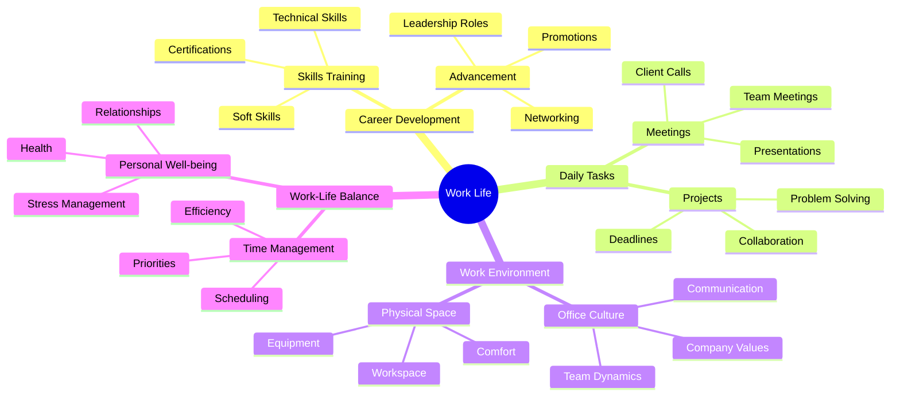
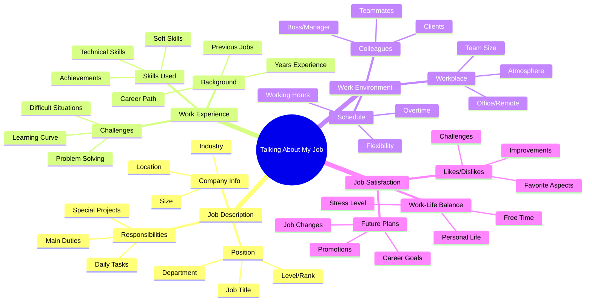
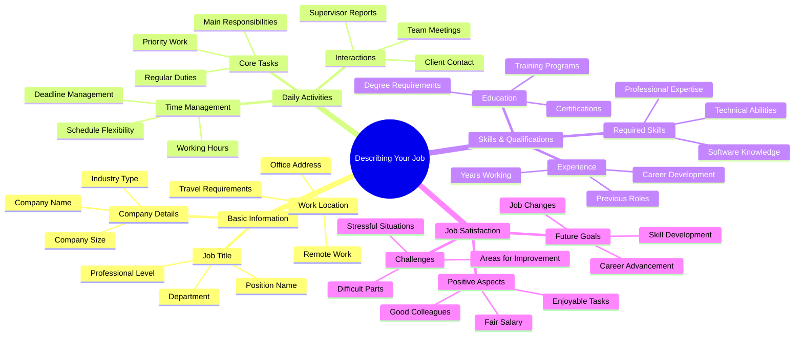
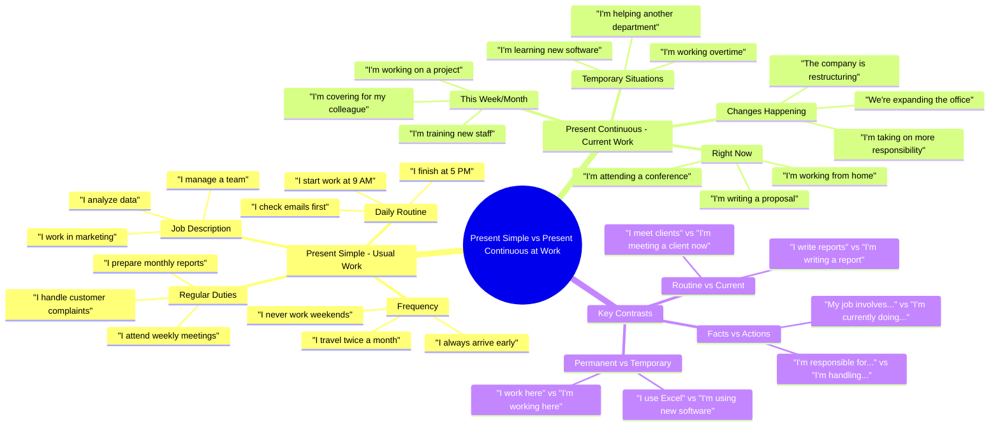
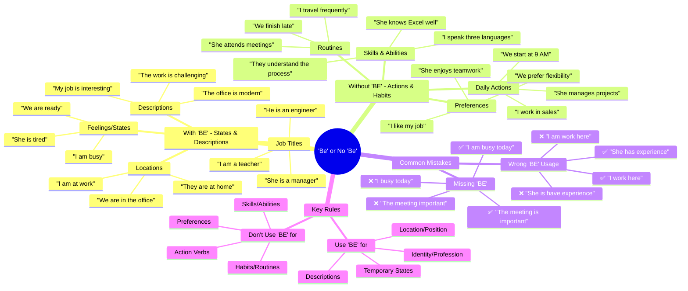

# Work life

```mermaid
mindmap
  root((Work Life))
    Career Development
      Skills Training
        Technical Skills
        Soft Skills
        Certifications
      Advancement
        Promotions
        Leadership Roles
        Networking
    
    Daily Tasks
      Meetings
        Team Meetings
        Client Calls
        Presentations
      Projects
        Deadlines
        Collaboration
        Problem Solving
    
    Work Environment
      Office Culture
        Team Dynamics
        Company Values
        Communication
      Physical Space
        Workspace
        Equipment
        Comfort
    
    Work-Life Balance
      Time Management
        Priorities
        Scheduling
        Efficiency
      Personal Well-being
        Stress Management
        Health
        Relationships
```

```mermaid
mindmap
  root((Talking About My Job))
    Job Description
      Position
        Job Title
        Department
        Level/Rank
      Responsibilities
        Main Duties
        Daily Tasks
        Special Projects
      Company Info
        Industry
        Size
        Location
    
    Work Experience
      Background
        Previous Jobs
        Career Path
        Years Experience
      Skills Used
        Technical Skills
        Soft Skills
        Achievements
      Challenges
        Difficult Situations
        Problem Solving
        Learning Curve
    
    Work Environment
      Workplace
        Office/Remote
        Team Size
        Atmosphere
      Schedule
        Working Hours
        Flexibility
        Overtime
      Colleagues
        Boss/Manager
        Teammates
        Clients
    
    Job Satisfaction
      Likes/Dislikes
        Favorite Aspects
        Challenges
        Improvements
      Future Plans
        Career Goals
        Promotions
        Job Changes
      Work-Life Balance
        Stress Level
        Free Time
        Personal Life
```

```mermaid
mindmap
  root((Describing Your Job))
    Basic Information
      Job Title
        Position Name
        Professional Level
        Department
      Company Details
        Company Name
        Industry Type
        Company Size
      Work Location
        Office Address
        Remote Work
        Travel Requirements
    
    Daily Activities
      Core Tasks
        Main Responsibilities
        Regular Duties
        Priority Work
      Time Management
        Working Hours
        Schedule Flexibility
        Deadline Management
      Interactions
        Team Meetings
        Client Contact
        Supervisor Reports
    
    Skills & Qualifications
      Required Skills
        Technical Abilities
        Software Knowledge
        Professional Expertise
      Education
        Degree Requirements
        Certifications
        Training Programs
      Experience
        Years Working
        Previous Roles
        Career Development
    
    Job Satisfaction
      Positive Aspects
        Enjoyable Tasks
        Good Colleagues
        Fair Salary
      Challenges
        Difficult Parts
        Stressful Situations
        Areas for Improvement
      Future Goals
        Career Advancement
        Skill Development
        Job Changes
```

```mermaid
mindmap
  root((Present Simple vs Present Continuous at Work))
    Present Simple - Usual Work
      Regular Duties
        "I handle customer complaints"
        "I attend weekly meetings"
        "I prepare monthly reports"
      Daily Routine
        "I start work at 9 AM"
        "I check emails first"
        "I finish at 5 PM"
      Job Description
        "I work in marketing"
        "I manage a team"
        "I analyze data"
      Frequency
        "I travel twice a month"
        "I always arrive early"
        "I never work weekends"
    
    Present Continuous - Current Work
      Right Now
        "I'm writing a proposal"
        "I'm attending a conference"
        "I'm working from home"
      This Week/Month
        "I'm training new staff"
        "I'm working on a project"
        "I'm covering for my colleague"
      Temporary Situations
        "I'm working overtime"
        "I'm learning new software"
        "I'm helping another department"
      Changes Happening
        "We're expanding the office"
        "I'm taking on more responsibility"
        "The company is restructuring"
    
    Key Contrasts
      Permanent vs Temporary
        "I work here" vs "I'm working here"
        "I use Excel" vs "I'm using new software"
      Routine vs Current
        "I meet clients" vs "I'm meeting a client now"
        "I write reports" vs "I'm writing a report"
      Facts vs Actions
        "My job involves..." vs "I'm currently doing..."
        "I'm responsible for..." vs "I'm handling..."
```

```mermaid
mindmap
  root(('Be' or No 'Be'))
    With 'BE' - States & Descriptions
      Job Titles
        "I am a teacher"
        "She is a manager"
        "He is an engineer"
      Locations
        "I am at work"
        "We are in the office"
        "They are at home"
      Feelings/States
        "I am busy"
        "She is tired"
        "We are ready"
      Descriptions
        "My job is interesting"
        "The work is challenging"
        "The office is modern"
    
    Without 'BE' - Actions & Habits
      Daily Actions
        "I work in sales"
        "She manages projects"
        "We start at 9 AM"
      Skills & Abilities
        "I speak three languages"
        "She knows Excel well"
        "They understand the process"
      Routines
        "I travel frequently"
        "She attends meetings"
        "We finish late"
      Preferences
        "I like my job"
        "She enjoys teamwork"
        "We prefer flexibility"
    
    Common Mistakes
      Wrong 'BE' Usage
        ❌ "I am work here"
        ✅ "I work here"
        ❌ "She is have experience"
        ✅ "She has experience"
      Missing 'BE'
        ❌ "I busy today"
        ✅ "I am busy today"
        ❌ "The meeting important"
        ✅ "The meeting is important"
    
    Key Rules
      Use 'BE' for
        Identity/Profession
        Location/Position
        Temporary States
        Descriptions
      Don't Use 'BE' for
        Action Verbs
        Habits/Routines
        Skills/Abilities
        Preferences
```
