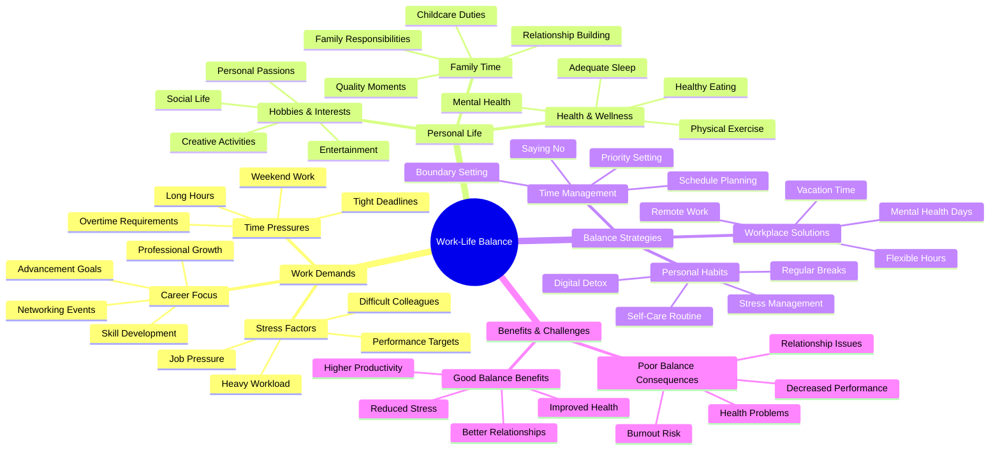
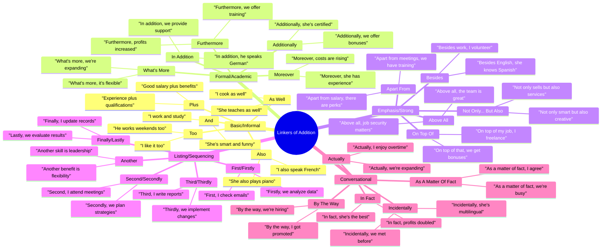

# Work-life balance

```mermaid
mindmap
  root((Work-Life Balance))
    Work Demands
      Time Pressures
        Long Hours
        Overtime Requirements
        Tight Deadlines
        Weekend Work
      Stress Factors
        Heavy Workload
        Difficult Colleagues
        Job Pressure
        Performance Targets
      Career Focus
        Advancement Goals
        Skill Development
        Professional Growth
        Networking Events
    
    Personal Life
      Family Time
        Quality Moments
        Family Responsibilities
        Childcare Duties
        Relationship Building
      Health & Wellness
        Physical Exercise
        Mental Health
        Adequate Sleep
        Healthy Eating
      Hobbies & Interests
        Personal Passions
        Creative Activities
        Social Life
        Entertainment
    
    Balance Strategies
      Time Management
        Priority Setting
        Schedule Planning
        Boundary Setting
        Saying No
      Workplace Solutions
        Flexible Hours
        Remote Work
        Vacation Time
        Mental Health Days
      Personal Habits
        Digital Detox
        Stress Management
        Regular Breaks
        Self-Care Routine
    
    Benefits & Challenges
      Good Balance Benefits
        Reduced Stress
        Better Relationships
        Improved Health
        Higher Productivity
      Poor Balance Consequences
        Burnout Risk
        Health Problems
        Relationship Issues
        Decreased Performance
```

```mermaid
mindmap
  root((Linkers of Addition))
    Basic/Informal
      And
        "I work and study"
        "She's smart and funny"
      Also
        "I also speak French"
        "She also plays piano"
      Too
        "I like it too"
        "He works weekends too"
      As Well
        "I cook as well"
        "She teaches as well"
      Plus
        "Good salary plus benefits"
        "Experience plus qualifications"
    
    Formal/Academic
      Furthermore
        "Furthermore, we offer training"
        "Furthermore, profits increased"
      Moreover
        "Moreover, she has experience"
        "Moreover, costs are rising"
      In Addition
        "In addition, we provide support"
        "In addition, he speaks German"
      Additionally
        "Additionally, we offer bonuses"
        "Additionally, she's certified"
      What's More
        "What's more, it's flexible"
        "What's more, we're expanding"
    
    Emphasis/Strong
      Not Only... But Also
        "Not only smart but also creative"
        "Not only sells but also services"
      Besides
        "Besides work, I volunteer"
        "Besides English, she knows Spanish"
      Apart From
        "Apart from salary, there are perks"
        "Apart from meetings, we have training"
      On Top Of
        "On top of my job, I freelance"
        "On top of that, we get bonuses"
      Above All
        "Above all, the team is great"
        "Above all, job security matters"
    
    Listing/Sequencing
      First/Firstly
        "First, I check emails"
        "Firstly, we analyze data"
      Second/Secondly
        "Second, I attend meetings"
        "Secondly, we plan strategies"
      Third/Thirdly
        "Third, I write reports"
        "Thirdly, we implement changes"
      Finally/Lastly
        "Finally, I update records"
        "Lastly, we evaluate results"
      Another
        "Another benefit is flexibility"
        "Another skill is leadership"
    
    Conversational
      By The Way
        "By the way, I got promoted"
        "By the way, we're hiring"
      Incidentally
        "Incidentally, she's multilingual"
        "Incidentally, we met before"
      As A Matter Of Fact
        "As a matter of fact, I agree"
        "As a matter of fact, we're busy"
      Actually
        "Actually, I enjoy overtime"
        "Actually, we're expanding"
      In Fact
        "In fact, profits doubled"
        "In fact, she's the best"
```
